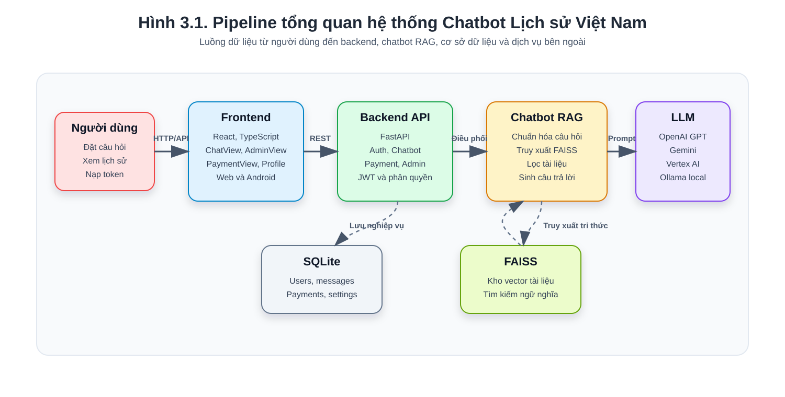
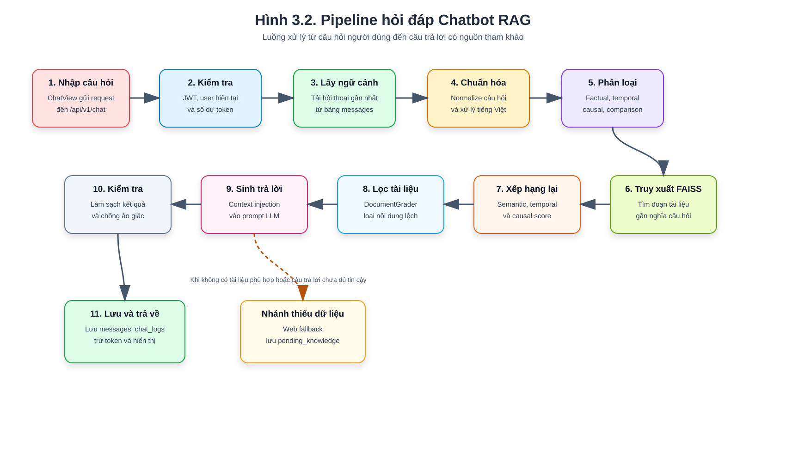

# CHƯƠNG 3: PHÂN TÍCH VÀ THIẾT KẾ PIPELINE HỆ THỐNG

## 3.1. Tổng quan hệ thống

Hệ thống trong đề tài được xây dựng theo hướng một sản phẩm chatbot AI hỗ trợ học tập và tra cứu kiến thức Lịch sử Việt Nam. Người dùng tương tác với hệ thống thông qua giao diện web hoặc ứng dụng di động, nhập câu hỏi bằng tiếng Việt và nhận lại câu trả lời từ chatbot. Điểm quan trọng của hệ thống là không để mô hình AI trả lời hoàn toàn độc lập, mà kết hợp mô hình ngôn ngữ lớn với kỹ thuật truy xuất tri thức từ tài liệu. Nhờ vậy, câu trả lời của chatbot có cơ sở dữ liệu tham khảo rõ ràng hơn, phù hợp với nội dung lịch sử Việt Nam và hạn chế tình trạng mô hình tạo ra thông tin không chính xác.

Về kiến trúc tổng thể, hệ thống gồm ba phần chính. Phần giao diện người dùng được xây dựng bằng React, TypeScript và Vite, đảm nhận việc hiển thị trang giới thiệu, màn hình chat, lịch sử hội thoại, hồ sơ cá nhân, thanh toán và trang quản trị. Phần backend được xây dựng bằng FastAPI, chịu trách nhiệm tiếp nhận request, xác thực người dùng, kiểm tra token, lưu dữ liệu hội thoại, xử lý thanh toán và điều phối luồng chatbot. Phần xử lý trí tuệ nhân tạo gồm các module trong thư mục `chatbot` và `ingestion`, đảm nhận chuẩn hóa câu hỏi, truy xuất tài liệu, xếp hạng kết quả, đánh giá tài liệu, sinh câu trả lời và nạp dữ liệu vào kho vector.

Hình 3.1 mô tả pipeline tổng quan của hệ thống. Người dùng gửi thao tác từ frontend, frontend gọi API đến backend, backend điều phối dữ liệu giữa cơ sở dữ liệu SQLite, kho vector FAISS và mô hình ngôn ngữ lớn. Cách tổ chức này giúp hệ thống tách biệt rõ ràng giữa giao diện, nghiệp vụ và xử lý AI, từ đó dễ bảo trì và dễ mở rộng trong tương lai.

## 3.2. Pipeline xác thực và quản lý người dùng

Pipeline xác thực bắt đầu khi người dùng đăng ký hoặc đăng nhập vào hệ thống. Với chức năng đăng ký, người dùng nhập tên đăng nhập, email và mật khẩu. Backend tiếp nhận dữ liệu thông qua router `auth`, kiểm tra tính hợp lệ của thông tin, mã hóa mật khẩu và lưu tài khoản vào bảng `users` trong cơ sở dữ liệu SQLite. Với chức năng đăng nhập thông thường, hệ thống đối chiếu tên đăng nhập và mật khẩu, nếu hợp lệ sẽ sinh access token dạng JWT để frontend lưu trữ và sử dụng cho các request tiếp theo.

Ngoài đăng nhập bằng tài khoản thường, hệ thống còn hỗ trợ đăng nhập bằng Google OAuth. Khi người dùng chọn đăng nhập Google, hệ thống chuyển hướng đến trang xác thực của Google. Sau khi xác thực thành công, backend nhận thông tin người dùng như email, họ tên và ảnh đại diện, sau đó tạo mới hoặc cập nhật tài khoản trong cơ sở dữ liệu. Cách làm này giúp giảm rào cản đăng nhập, phù hợp với một sản phẩm hướng đến người dùng phổ thông như học sinh, sinh viên và giáo viên.

Sau khi đăng nhập, mỗi request quan trọng từ frontend đều gửi kèm JWT. Backend sử dụng module bảo mật để xác định người dùng hiện tại và kiểm tra quyền truy cập. Nếu tài khoản có quyền quản trị, hệ thống cho phép truy cập các chức năng admin. Nếu là người dùng thông thường, hệ thống chỉ cho phép sử dụng các chức năng như hỏi đáp, quản lý hội thoại, cập nhật hồ sơ và nạp token. Cách phân quyền này giúp bảo vệ dữ liệu người dùng, dữ liệu thanh toán và các cấu hình quan trọng của hệ thống.

## 3.3. Pipeline hỏi đáp chatbot

Pipeline hỏi đáp là luồng xử lý trung tâm của hệ thống. Quá trình này bắt đầu khi người dùng nhập câu hỏi tại giao diện chat. Frontend gửi câu hỏi đến endpoint `/api/v1/chat` của backend. Backend tiếp nhận request, kiểm tra người dùng hiện tại, kiểm tra số dư token và xác định cuộc hội thoại đang hoạt động. Nếu chưa có cuộc hội thoại phù hợp, hệ thống có thể tạo hội thoại mới trong bảng `conversations`.

Trước khi chuyển câu hỏi vào mô hình AI, backend lấy lịch sử hội thoại gần nhất từ bảng `messages`. Lịch sử này giúp chatbot hiểu ngữ cảnh của câu hỏi hiện tại, đặc biệt trong các trường hợp người dùng hỏi tiếp bằng những câu phụ thuộc vào nội dung trước đó. Ví dụ, sau khi hỏi về một nhân vật lịch sử, người dùng có thể hỏi tiếp “vì sao ông ấy làm như vậy?”; khi đó lịch sử hội thoại giúp hệ thống xác định chủ thể mà người dùng đang nhắc tới.

Sau bước chuẩn bị dữ liệu, câu hỏi được đưa vào workflow của chatbot trong module `FilesChatAgent`. Workflow này gồm các bước truy xuất tài liệu, đánh giá tài liệu, quyết định sinh câu trả lời hoặc chuyển sang xử lý khi thiếu dữ liệu. Khi pipeline hoàn tất, backend lưu câu hỏi và câu trả lời vào bảng `messages`, lưu nhật ký vào bảng `chat_logs`, tính lượng token đã sử dụng, trừ số dư token của người dùng và trả kết quả về frontend để hiển thị.

Hình 3.2 thể hiện pipeline hỏi đáp RAG của hệ thống từ lúc người dùng nhập câu hỏi đến lúc chatbot trả lời và lưu dữ liệu.

## 3.4. Pipeline RAG truy xuất và sinh câu trả lời

Trong pipeline RAG, bước đầu tiên là chuẩn hóa câu hỏi. Hệ thống xử lý câu hỏi tiếng Việt để giảm nhiễu, đưa câu hỏi về dạng thuận lợi hơn cho tìm kiếm và giữ lại nội dung chính. Sau đó, câu hỏi được phân loại theo ý định, chẳng hạn câu hỏi về sự kiện, câu hỏi thời gian, câu hỏi nguyên nhân, câu hỏi so sánh hoặc câu hỏi nằm ngoài phạm vi Lịch sử Việt Nam. Bước phân loại này giúp hệ thống lựa chọn cách xếp hạng tài liệu phù hợp hơn với từng loại câu hỏi.

Sau khi phân loại, hệ thống sử dụng FAISS để tìm kiếm các đoạn tài liệu liên quan trong kho vector. Các tài liệu lịch sử đã được xử lý trước đó bằng pipeline nạp dữ liệu, được chia nhỏ thành các đoạn văn bản và chuyển thành embedding. Khi người dùng đặt câu hỏi, câu hỏi cũng được biểu diễn dưới dạng vector để so sánh với các vector tài liệu. Những đoạn có độ tương đồng cao được chọn làm ứng viên cho bước tiếp theo.

Các tài liệu ứng viên chưa được đưa ngay vào prompt, mà được xếp hạng lại bằng cơ chế Adaptive RAG. Cơ chế này không chỉ dựa trên độ tương đồng ngữ nghĩa, mà còn xét thêm yếu tố thời gian và quan hệ nguyên nhân. Đây là điểm phù hợp với lĩnh vực lịch sử, vì một câu trả lời đúng thường cần đặt trong đúng mốc thời gian, đúng bối cảnh và đúng quan hệ nguyên nhân - kết quả. Ví dụ, khi người dùng hỏi về nguyên nhân của một cuộc khởi nghĩa, hệ thống cần ưu tiên các tài liệu có nội dung giải thích bối cảnh, nguyên nhân trực tiếp và nguyên nhân sâu xa thay vì chỉ chọn tài liệu trùng từ khóa.

Sau bước xếp hạng, hệ thống dùng bộ đánh giá tài liệu để loại bỏ các đoạn không liên quan. Những tài liệu phù hợp được ghép thành ngữ cảnh và đưa vào prompt cho mô hình ngôn ngữ lớn. Mô hình AI sinh câu trả lời dựa trên câu hỏi, lịch sử hội thoại và các tài liệu được cung cấp. Nhờ kỹ thuật context injection, câu trả lời không chỉ dựa vào kiến thức tổng quát của mô hình mà còn dựa trên kho tri thức nội bộ của hệ thống.

## 3.5. Pipeline kiểm soát chất lượng câu trả lời

Một yêu cầu quan trọng của chatbot lịch sử là hạn chế trả lời sai hoặc tự suy diễn thông tin. Vì vậy, sau khi mô hình ngôn ngữ lớn sinh câu trả lời, hệ thống tiếp tục thực hiện một số bước kiểm soát. Câu trả lời được làm sạch, loại bỏ các định dạng không cần thiết và kiểm tra xem có dấu hiệu từ chối, thiếu dữ liệu hoặc không bám sát tài liệu hay không.

Trong code, hệ thống có cơ chế phát hiện khi mô hình trả lời theo hướng không có dữ liệu hoặc có nguy cơ hallucination. Nếu câu trả lời không đủ tin cậy, pipeline có thể chuyển sang nhánh xử lý thiếu dữ liệu thay vì trả lời trực tiếp cho người dùng. Điều này đặc biệt cần thiết với lĩnh vực lịch sử, vì các mốc thời gian, tên nhân vật và quan hệ sự kiện cần độ chính xác cao.

Ngoài ra, hệ thống còn cho phép người dùng đánh giá câu trả lời thông qua thao tác thích hoặc không thích. Dữ liệu đánh giá được lưu lại trong bảng `messages` và có thể hỗ trợ việc cải thiện tri thức về sau. Những phản hồi tiêu cực cũng có thể được admin xem xét trong khu vực quản trị, từ đó phát hiện các câu trả lời chưa phù hợp và điều chỉnh dữ liệu hoặc quy trình xử lý.

## 3.6. Pipeline xử lý khi thiếu dữ liệu và tự học có kiểm duyệt

Trong trường hợp hệ thống không tìm thấy tài liệu phù hợp trong FAISS, chatbot không tự ý bịa ra câu trả lời. Trước hết, hệ thống kiểm tra câu hỏi có thuộc phạm vi Lịch sử Việt Nam hay không. Nếu câu hỏi nằm ngoài phạm vi, chatbot sẽ từ chối trả lời và thông báo rằng hệ thống chỉ hỗ trợ các nội dung liên quan đến Lịch sử Việt Nam. Cách xử lý này giúp chatbot giữ đúng định hướng chuyên môn của sản phẩm.

Nếu câu hỏi vẫn thuộc phạm vi lịch sử nhưng kho dữ liệu nội bộ chưa có thông tin, hệ thống có thể chuyển sang WebLearningAgent để tìm kiếm bổ sung từ Internet. Các nguồn tìm được được xử lý, trích xuất nội dung và kiểm tra mức độ liên quan. Nếu thông tin đủ tin cậy, hệ thống tạo câu trả lời tham khảo và lưu vào bảng `pending_knowledge` với trạng thái chờ duyệt.

Điểm quan trọng là tri thức mới không được đưa ngay vào kho chính thức. Quản trị viên cần kiểm tra nội dung trước khi phê duyệt. Sau khi được duyệt, tri thức mới có thể được sử dụng để mở rộng khả năng trả lời của chatbot. Đây là cơ chế tự học có kiểm duyệt, giúp hệ thống cải thiện dần theo thời gian nhưng vẫn đảm bảo nội dung được kiểm soát.

## 3.7. Pipeline nạp dữ liệu vào kho tri thức

Để chatbot có thể trả lời dựa trên tài liệu, dữ liệu lịch sử cần được nạp vào kho tri thức trước. Pipeline này được xử lý trong thư mục `ingestion`. Các tài liệu đầu vào có thể ở nhiều định dạng như PDF, DOCX hoặc TXT. Hệ thống sử dụng các loader phù hợp để đọc nội dung, sau đó chia văn bản thành nhiều đoạn nhỏ nhằm thuận tiện cho tìm kiếm vector và tránh vượt quá giới hạn ngữ cảnh của mô hình ngôn ngữ lớn.

Sau khi chia nhỏ, từng đoạn văn bản được chuyển thành vector embedding bằng mô hình embedding đã cấu hình, chẳng hạn OpenAI Embeddings, Vertex AI embedding hoặc HuggingFace. Các vector này cùng metadata của tài liệu được lưu vào FAISS vector store. Khi người dùng đặt câu hỏi, retriever sẽ tìm trong FAISS các đoạn tài liệu gần nghĩa nhất và chuyển chúng sang pipeline RAG để sinh câu trả lời.

Hình 3.3 mô tả pipeline nạp dữ liệu vào kho tri thức. Đây là pipeline nền tảng ảnh hưởng trực tiếp đến chất lượng chatbot. Nếu tài liệu đầu vào đầy đủ, rõ ràng và đúng chủ đề, hệ thống sẽ có khả năng truy xuất thông tin chính xác hơn. Ngược lại, nếu dữ liệu thiếu hoặc chưa được xử lý tốt, chatbot có thể không tìm được ngữ cảnh phù hợp và phải chuyển sang nhánh fallback.

## 3.8. Pipeline thanh toán và quản lý token

Hệ thống sử dụng cơ chế token để quản lý lượt sử dụng chatbot. Mỗi tài khoản có số dư token được lưu trong bảng `users`. Khi người dùng gửi câu hỏi, backend tính lượng token tiêu thụ dựa trên quá trình xử lý và câu trả lời, sau đó trừ vào số dư hiện tại. Các biến động token được ghi nhận trong bảng `token_history`, giúp người dùng và quản trị viên theo dõi lịch sử sử dụng.

Khi muốn nạp thêm token, người dùng truy cập trang thanh toán và chọn một gói trong danh sách `packages`. Backend tạo bản ghi giao dịch trong bảng `payments`, sinh thông tin chuyển khoản và mã QR thông qua SePay/VietQR. Người dùng thực hiện thanh toán theo nội dung được cung cấp. Sau đó, hệ thống kiểm tra trạng thái giao dịch; nếu thanh toán thành công, trạng thái payment được cập nhật thành `completed`, token được cộng vào tài khoản và lịch sử token được ghi lại.

Trong trường hợp có sự cố thanh toán, người dùng có thể gửi báo cáo. Báo cáo này được lưu trong bảng `payment_reports` để quản trị viên kiểm tra và xử lý. Pipeline thanh toán giúp hệ thống có khả năng vận hành như một sản phẩm có mô hình doanh thu, phù hợp với định hướng của môn Khởi nghiệp và Đổi mới sáng tạo.

## 3.9. Pipeline quản trị hệ thống

Pipeline quản trị dành cho tài khoản admin. Sau khi đăng nhập, backend kiểm tra quyền admin trước khi cho phép truy cập các API quản trị. Admin có thể xem danh sách người dùng, cập nhật thông tin tài khoản, xóa người dùng, điều chỉnh số dư token, quản lý gói nạp, theo dõi lịch sử thanh toán và xem báo cáo sự cố.

Ngoài quản lý người dùng và thanh toán, admin còn có thể theo dõi nhật ký chat. Các câu hỏi, câu trả lời và số token sử dụng được lưu trong bảng `chat_logs`. Dữ liệu này giúp admin đánh giá mức độ sử dụng hệ thống, phát hiện các câu trả lời chưa phù hợp và có cơ sở để cải thiện chất lượng chatbot.

Admin cũng quản lý tri thức chờ duyệt. Những câu trả lời được hệ thống thu thập từ web hoặc phát sinh từ cơ chế tự học có thể được lưu trong bảng `pending_knowledge`. Admin xem nội dung, kiểm tra độ phù hợp và quyết định phê duyệt hoặc xóa. Hình 3.4 mô tả pipeline thanh toán, quản lý token và quản trị tri thức của hệ thống.

## 3.10. Thiết kế lưu trữ dữ liệu phục vụ pipeline

Cơ sở dữ liệu của hệ thống được triển khai bằng SQLite và được khởi tạo thông qua lớp `BaseDB`. Các bảng dữ liệu được thiết kế nhằm phục vụ trực tiếp cho từng pipeline. Bảng `users` lưu thông tin tài khoản, quyền admin và số dư token. Bảng `conversations` và `messages` lưu lịch sử hội thoại, nội dung tin nhắn, nguồn tham khảo, đánh giá và số lượt thích. Nhóm bảng này phục vụ pipeline hỏi đáp và giúp người dùng xem lại quá trình tương tác với chatbot.

Nhóm bảng `packages`, `payments`, `payment_reports` và `token_history` phục vụ pipeline thanh toán và quản lý token. Bảng `packages` lưu các gói nạp, bảng `payments` lưu giao dịch, bảng `payment_reports` lưu báo cáo sự cố và bảng `token_history` lưu biến động token. Nhóm bảng này giúp hệ thống theo dõi được việc nạp, trừ và đối soát token.

Nhóm bảng `chat_logs`, `pending_knowledge` và `user_knowledge_likes` phục vụ pipeline quản trị chất lượng và tự học có kiểm duyệt. Bảng `chat_logs` giúp admin theo dõi hoạt động hỏi đáp, bảng `pending_knowledge` lưu tri thức mới chờ duyệt, còn bảng `user_knowledge_likes` giúp hạn chế việc một người dùng thích trùng một nội dung nhiều lần. Ngoài ra, bảng `settings` lưu các cấu hình hệ thống như tiêu đề website, logo, ảnh nền và tỉ lệ tính token.

## 3.11. Nhận xét thiết kế pipeline

Nhìn chung, hệ thống được thiết kế theo hướng chia nhỏ thành nhiều pipeline độc lập nhưng có liên kết với nhau. Pipeline xác thực đảm bảo người dùng được định danh và phân quyền rõ ràng. Pipeline hỏi đáp và RAG đảm nhiệm chức năng cốt lõi là truy xuất tri thức và sinh câu trả lời. Pipeline fallback giúp hệ thống xử lý trường hợp thiếu dữ liệu, trong khi pipeline nạp dữ liệu giúp mở rộng kho tri thức. Pipeline thanh toán và quản trị hỗ trợ hệ thống vận hành như một sản phẩm có khả năng thương mại hóa.

Cách thiết kế này phù hợp với mục tiêu xây dựng một chatbot chuyên biệt cho Lịch sử Việt Nam. Hệ thống không chỉ trả lời câu hỏi mà còn lưu lịch sử, kiểm soát token, quản lý người dùng, mở rộng tri thức và kiểm duyệt nội dung. Đây là nền tảng quan trọng để sản phẩm có thể tiếp tục phát triển trong tương lai, bổ sung thêm dữ liệu, cải thiện chất lượng AI và mở rộng sang nhiều nhóm người dùng trong lĩnh vực giáo dục.
